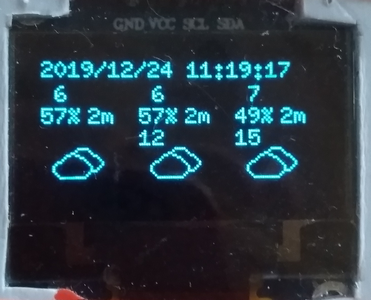

# 8266_weather_station
Simple weather station ESP8266 with 0.96 i2c OLED

These are three configuration in lua script.

1. In "apconn.lua", you must specify SSID/Password
2. In "weather.lua", yout must specify OpenWeatherMap AppId and country and city.
3. In "weather.lua", you must specify your local time offset from GMT time.
